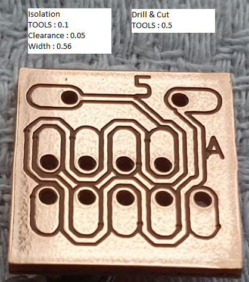
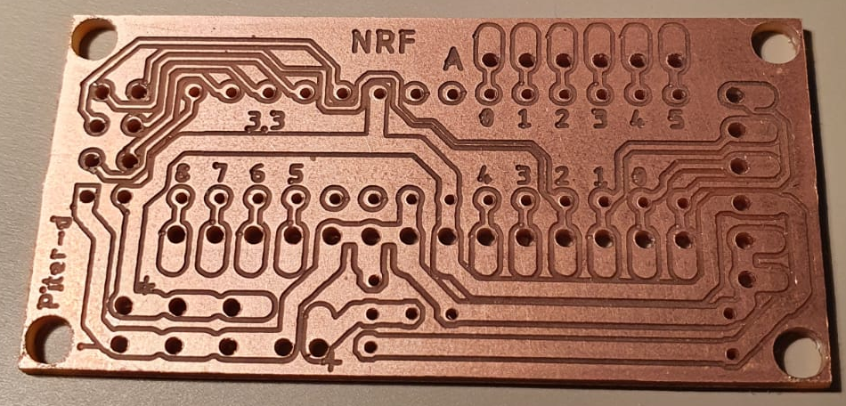

# PCB_CNC

L'idée générale est de graver une plaque de PCB avec une machine CNC de façon industrielle
L'opération se réalise en plusieurs étapes:
- Construction d'une machine cnc avec :
  - Le maximum de matériaux de grande distribution
    - Tiges filetées diamètre 6
    - Tiges carrées en aluminium coté 15mm
    - planche MDF
    - Vis diametre 4 longueur 16mm avec écrous
    - Une dremel de base
  - Quelques composants achetés chez Aliexpress
    - Roulement diamètre 6
    - 5 x TB6560 (controleurs de moteurs pas à pas)
    - 5 x NEMA 17 (2A)
    - 1 x ESP32 (que je n'utilse pas en WiFi car chez moi ça ne marche pas très bien)
    - 1 relai pour démarrer la Dremel automatiquement
  - Deux bobines de PLA d'un kg achetées chez Amazon 
  - Des éléments de récupération (ou que j'avais déjà)
    - 1 x Alimentation 12V 10A
    - 2 x STEPDOWN DC (1 configuré en 3,3V et l'autre en 5V)
    - 1 x STEPDOWN + 1 BC557 pour alimenter le ventillateur
  - Les autres pièces ont été dessinées sous sketchup et imprimées avec ma petite Tiertime UP Mini
  - Bref, un peu moins de 100€ investis et une table CNC plutôt de bonne facture pour ce rapport qualité/prix. C'est un point très important pour la précision des circuits imprimés réalisés
- Génération de fichiers gerber
  - J'utilise Eagle avec un cam spécifique [fichier CAM](cnc.cam) (créé directement dans Eagle)
  - Mes paramètres Eagle sont
    - Clearance = 0.05mm (dans le menu Edit/Design rules/Clearance pour tous les paramètres)
    - Création de net spécifiques (dans le menu Edit/Net classes)
      - "CNC_Data" avec Clearance=0.05mm, Width=0.56mm) pour que ça passe exactement entre les grosses pastilles
      - "CNC_power" avec Clearance=0.05mm
- Utilisation de flatCam pour les convertir en gcode
  - La version que j'utilise est la 8.993 BETA 64bit (la version suivante ne semble pas interpréter le script tcl)
  - J'ai construit un petit script windows pour passer le repertoire courant en parametre [fichier bat](FlatCAM.bat)
  - Et un autre script en tcl pour piloter FlatCAM [fichier flatcam](generic.FlatScript)
  - A la fin il y a un enchainement pour fabriquer une version en 90°
  - La syntaxe est : FlatCAM 0.1 qui génère tous les fichiers avec une point de 0,1 et un maïs de 0,5 dans deux fichiers séparés
- Gravure avec la CNC en utilisant bCNC
  - (Je n'ai pas réussi a utiliser Candle qui semble plus fluide mais qui se bloque au bout d'un moment sur de gros fichiers)
  - bCNC permet de faire une première mise au point en probe sur l'axe des Z
  - Et ensuite de faire un palpage de surface automatique avant de lancer l'impression
  - Je lance en premier isolation.nc avec une pointe 60° 0,1mm puis drill_and_cut.nc avec un maïs de 0,5mm

## Résultats
Voici un premier résultat en faisant passer une via entre deux grosses pastilles; pas si mal

Pour le test suivant, un peu plus complet, on voit que les pad trop petits ne sont pas très bien découpés. J'utiliserai donc des pad plus grandes

