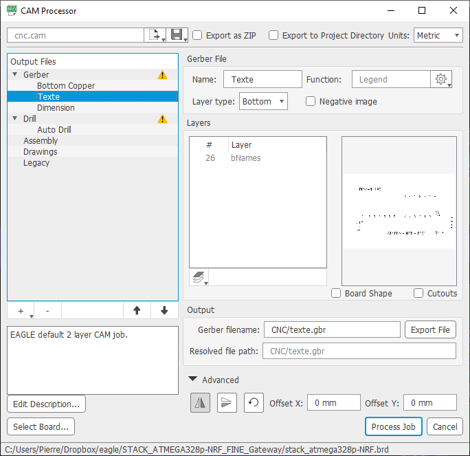

# PCB_CNC

**<u>Avertissement :</u>** Je ne suis qu'un amateur, l'électronique n'est pas mon métier. Il est donc probable que ce que je présente ci-dessous puisse être réalisé de façon plus simple ou mieux optimisée. 

**Pourquoi ce post :**

Utilisateur des services de gravure de circuit imprimé en Chine (j'en ai utilisé plusieurs différents), j'ai eu envie de réaliser une chaine de fabrication qui me permette de graver un circuit en une heure

**Avantages de faire fabriquer des circuits en Chine**

-  Prix avantageux (pour une petite vingtaine d'euros on peut avoir une dizaine de circuits imprimés)
- Accessibilité du double face, voire 4
- Finesse de la gravure
- Finition du circuit imprimé (et facilité de soudure)
- Génial pour des petites séries

**Inconvénients de faire fabriquer des circuits en Chine**

- Délais de réalisation (pour garder un prix faible). Pour moi, environ 1 mois
- Quasi obligation d'acheter les circuits par 10 (prix identique)

**J'ai eu envie de faire quelque chose de différent qui me permette de tout faire moi-même.**

**Avantage d'utiliser une chaine de fabrication maison**

- Rapidité de réalisation d'un circuit (pas de transport)
- Possibilité de faire un seul exemplaire
- Le plaisir de construire

**Inconvénient d'utiliser une chaine de fabrication maison**

- Il faut avoir un peu de matériel (une CNC, ...)
- La finesse de gravure est très faible. J'arrive uniquement à faire une piste qui passe entre deux pastilles :-)
- La qualité du circuit et l'importance de soigner les soudures (difficile de ressouder sans décoller les pastilles)


Après ces considérations, ...

L'idée générale est de graver une plaque de PCB avec une machine CNC de façon industrielle
L'opération se réalise en plusieurs étapes:

- **Construction d'une machine cnc avec :**
  
  - Le maximum de matériaux de grande distribution
    - Tiges filetées diamètre 6
    - Tiges carrées en aluminium coté 15mm
    - planche MDF
    - Vis diamètre 4 longueur 16mm avec écrous
    - Une dremel de base
    
  - Quelques composants achetés chez Aliexpress
    - Roulement diamètre 6 (il en faut environ 58)
    - 5 x TB6560 (contrôleurs de moteurs pas à pas)
    - 5 x NEMA 17 (2A)
    - 1 x ESP32 (que je utilise pas en WiFi car chez moi ça ne marche pas très bien)
    - 1 relai pour démarrer la Dremel automatiquement
    
  - Deux bobines de PLA d'un kg achetées chez Amazon 
  
  - Des éléments de récupération (ou que j'avais déjà)
    - 1 x Alimentation 12V 10A
    - 2 x STEPDOWN DC (1 configuré en 3,3V et l'autre en 5V)
    - 1 x STEPDOWN + 1 BC557 pour alimenter le ventilateur
    
  - Les autres pièces ont été dessinées sous sketchup et imprimées avec ma petite Tiertime UP Mini
  
    Le fichier sketchup est  [CNC.skp](3D\CNC.skp) (attention car l'assemblage présenté dans le fichier ne reflète pas mon montage exact, je l'ai adapté au fur et à mesure. En particulier j'ai tout fait à partir de vis et non par emboitement en force. Par contre les pièces individuelles devraient être correctes)
  
    
  
    Un exemple de pièce que vous y trouverez qui est le profile le plus important car, avec 4 roulements de diamètre 6, il permet de gérer le déplacement.
  
  - J'ai investit un peu moins de 100€ investis. La table me convient pour ce rapport qualité/prix. C'est un point très important pour la précision des circuits imprimés réalisés
  
  - Une photo (pas très bien prise de ma CNC)
  
    
  
    
  
  - Si cela intéresse quelqu'un, je pourrai faire un tutorial sur ce sujet quand j'aurai le temps. On peut voir ma lime et ma brosse à dents pour les finitions ;-)
  
- **Génération de fichiers gerber**

  - J'utilise Eagle v 9.6.2 avec un cam spécifique [fichier CAM](cnc.cam) (créé directement dans Eagle)

    

    Vous pouvez remarquer que dans le menu "advanced", j'ai coché "Mirror"

    

    

    

  - Mes paramètres pour une gravure avec une fraise 0.1 Eagle sont

    - Clearance = 0.05mm (dans le menu Edit/Design rules/Clearance pour tous les paramètres)

      

      

    - Création de net spécifiques (dans le menu Edit/Net classes)

      

      - "CNC_data" avec Clearance=0.05mm, Width=0.56mm) pour que ça passe exactement entre les grosses pastilles
      - "CNC_power" avec Clearance=0.05mm
      - Et évidemment, il faut que les objets aient comme propriété de NetClass la bonne valeur

  - Pour une gravure avec une fraise de 0.5
  
    - dans les paramètre généraux 6mil (0.1524mm) (Ca ne sert pas à grand chose mais c'est par défaut)
    - dans le net classes Width=34mil et Clearance=0,3476mm (0.5mm-6mil) pour que le bord d'une piste soit le bord de l'autre
    - pour les via, il faut prendre 70mil et au moins 24mil de trou
  
  - Exemple de board

    

    Les grosses pastilles sont celles qui sont en bas. Vous remarquez que les pistes CNC_data passent exactement entre les grosses pastilles (ex: avec D2)

  - En lançant File/CAM Processor.../Load Job File/Open CAM File/cnc.cam et en cliquant sur "Process Job" (avec les confirmations), on obtient dans le répertoire CNC les fichiers

    ``````bash
    $ ls -lrt
    -rw-r--r-- 1 Pierre Aucun    8908 27 déc.  10:46 dessous.gbr
    -rw-r--r-- 1 Pierre Aucun   82987 27 déc.  10:46 texte.gbr
    -rw-r--r-- 1 Pierre Aucun   19814 27 déc.  10:46 dimension.gbr
    -rw-r--r-- 1 Pierre Aucun     592 27 déc.  10:46 gerber_job.gbrjob
    -rw-r--r-- 1 Pierre Aucun    1252 27 déc.  10:46 drill.xln
    ``````

    Ces fichiers sont les fichiers gerber utilisés par la section suivante avec flatCam

- **Utilisation de flatCam pour les convertir en gcode**
  
  - La version que j'utilise est la 8.993 BETA 64bit (la version suivante ne semble pas interpréter le script tcl comme je le veux)
  
  - J'ai construit un petit script windows pour passer le répertoire courant en paramètre [fichier bat](FlatCAM.bat) car je ne savais pas faire autrement
  
    - Ce script utilise aussi un petit outil qui s'appelle grecode (https://github.com/bkubicek/grecode) pour adapter le fichier gcode a 90° ce qui peut être pratique pour optimiser la place qui reste sur votre plaque de circuit imprimé. J'en profite pour remercier Bernhard Kubicek pour son travail
  
  - Et un autre script en tcl pour piloter FlatCAM [fichier flatcam](generic.FlatScript)
  
  - A la fin il y a un enchainement pour fabriquer une version en 90°
  
  - La syntaxe est : FlatCAM 0.1 qui génère tous les fichiers avec une pointe de 0,1 et un maïs de 0,5 dans deux fichiers séparés
  
    - la pointe de 0,1 est une pointe javelot de 60° et sert uniquement a faire les isolations et le texte
    - la fraise de 0,5 est une fraise maïs de 0,5 et sert uniquement a fraiser les trous et les contours
  
  - Un exemple de ce qui est généré
  
    
  
    Et voici la liste des fichiers générés
  
    ``````bash
    $ ls -lrt
    -rw-r--r-- 1 Pierre Aucun    8908 27 déc.  10:46 dessous.gbr
    -rw-r--r-- 1 Pierre Aucun   82987 27 déc.  10:46 texte.gbr
    -rw-r--r-- 1 Pierre Aucun   19814 27 déc.  10:46 dimension.gbr
    -rw-r--r-- 1 Pierre Aucun     592 27 déc.  10:46 gerber_job.gbrjob
    -rw-r--r-- 1 Pierre Aucun    1252 27 déc.  10:46 drill.xln
    -rw-r--r-- 1 Pierre Aucun  195693 27 déc.  10:50 isolate.nc
    -rw-r--r-- 1 Pierre Aucun  595575 27 déc.  10:50 drill_and_cut.nc
    -rw-r--r-- 1 Pierre Aucun  791256 27 déc.  10:50 complet.nc
    ``````
  
    Il y a 3 nouveaux fichiers en gcode
  
    - isolate.nc permet de graver avec une fraise de 0.1
  
    - drill_and_cut.nc permet de graver avec une fraise maïs de 0.5
    - complet.nc qui sert si on utilise uniquement la fraise maïs de 0.5 (et donc avec une précision moins bonne mais une réalisation sans changement d'outil). Dans ce cas, l'appel doit être "flatcam 0.5"
  
- **Gravure avec la CNC en utilisant bCNC**
  
  - (Je n'ai pas réussi a utiliser Candle qui semble plus fluide mais qui se bloque au bout d'un moment sur de gros fichiers)
  
  - bCNC permet de faire une première mise au point en probe sur l'axe des Z
  
  - Et ensuite de faire un palpage de surface automatique avant de lancer l'impression
  
  - Je lance en premier isolation.nc avec une pointe 60° 0,1mm puis drill_and_cut.nc avec un maïs de 0,5mm. Entre les deux étapes, je change la fraise et je refais uniquement un probe Z en position X0Y0.
  
    
  
    "isolate.nc"
  
    
  
    "drill_and_cut.nc". Vous pouvez remarquer que pour faire les trous, la fraise maïs fait des cercles. De plus, les trous ne se font pas en 1 fois, mais progressivement (comme on peut le voir dans le script tcl).
  
    On commence par faire les trous, et enfin la découpe. A la fin de la découpe, il reste deux petites attaches qui sont à casser pour prendre le circuit.
  
  - A la fin de la gravure, la pièce se détache très facilement. Avec une lime métal, je passe un coup léger sur les fixations. Et avec une lime à ongle multi-face, je brosse légèrement le circuit et enfin avec un petit coup de brosse à dents, j'élimine toutes les poussières.

## Résultats
Voici un premier résultat en faisant passer une via entre deux grosses pastilles. On repère un petit point à chaque descente de la fraise, mais rien de grave (peut être un défaut dans le script TCL)


Pour le test suivant, un peu plus complet, on voit que les pad trop petits ne sont pas très bien découpés. J'utiliserai donc des pad plus grands.


Voici la gravure correspondante au schéma initial.


Il y a un problème à régler : Certaines petites fontes ne sont pas gravées (j'aurai du le voir dans la génération flatcam car c'était déjà visible)


Voici la version visible à travers une lumière
